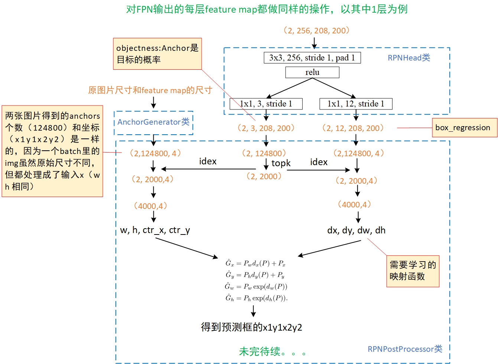

# 安装环境
ubuntu 18  
cuda 9  
python 3.6  
torch 1.0.0  
torchvision 0.2.0 
## Error
1. apex安装出现 `error: expected primary-expression before 'some' token`
  办法：恢复到apex的早期版本
  ```sh
  git checkout f3a960f80244cf9e80558ab30f7f7e8cbf03c0a0
  ```
# 参考
https://www.cnblogs.com/wangyong/p/10614898.html
# 代码
## 数据
利用torchvision.datasets.coco.CocoDetection类读取coco数据，target的box一开始是(x,y,w,h)格式，后通过BoxList类转为（xyxy）,以像素值而非百分比的格式输入模型
## backbone结构

## rpn结构（还没整理完）

